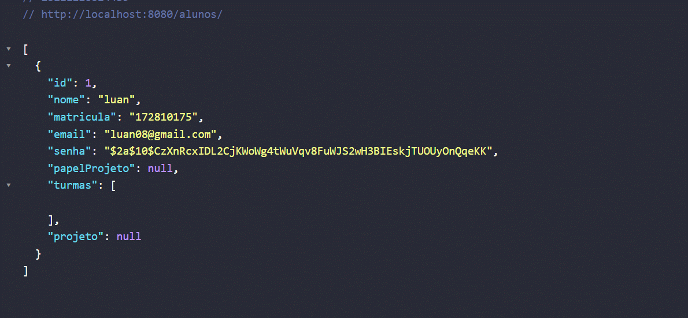
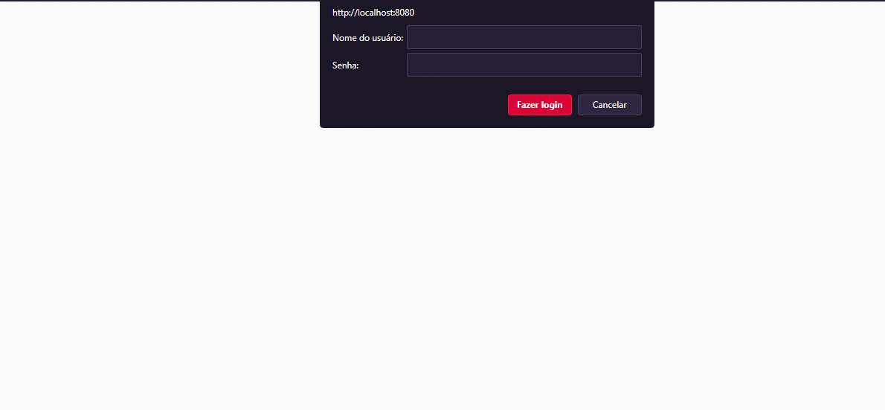

# PROJETO 1 - CRUD Controle Academico
## Programacao WEB - 2022

### Grupo:
  - Luan Fellipe
  - Matheus Possidonio
 
### [*] Funcionalidades Adicionadas:
  - CRUD de projetos.
  - Vinculo de alunos a projetos de professor com um papel (estágio, júnior, pleno, sênior, master, etc.)
  - Listagem de integrantes do projeto pelo professor.
  - Cadastro de usuários como aluno e professor.
  - Qualquer usuário pode visualizar quaisquer projetos e seu detalhamento.

### [*] Exemplo cadastro de Aluno:

### [*] Exemplo login:

 
